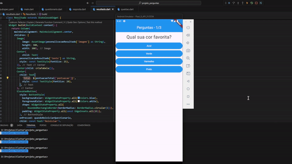

# projeto_perguntas

Após a conclusão do módulo, decidi explorar e tentar melhorar, algumas essas foram as modificações:

- Colocar um contabilizador de perguntas respondidas;
- Exibir um gif para cada nivel de pontuação;
- Mostrar pontos obitidos em cada pergunta;

## Preview

